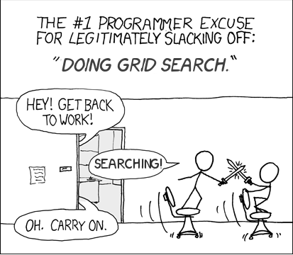

xkcd-rework-searching
=====================

A retake of xkcd comic '[compiling](http://xkcd.com/303/)' in a theme that makes better
sense to computer scientists.  The font is from [xkcd-font](https://github.com/ipython/xkcd-font).


  

To produce PNG output, use imagemagick:
```
convert -layers merge searching.xcf searching.png
```

This work is licensed under a Creative Commons Attribution-NonCommercial 3.0 License.
